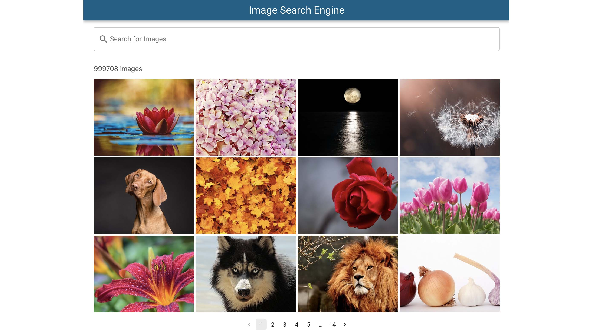

# Image Search Engine
[Demo](https://tbm85.github.io/demo-image-search-engine/)

## Description
An Image Search Engine made with React JS

This project was bootstrapped with [Create React App](https://github.com/facebook/create-react-app).

## Resources
* [Material UI](https://material-ui.com/)
* [Material UI Icons](https://material-ui.com/components/material-icons/)
* [Pixabay API](https://pixabay.com/api/docs/)
* [Axios](https://www.npmjs.com/package/axios)
* [React Spinners](https://www.npmjs.com/package/react-spinners)

## How to run this app
* Clone: `git clone https://github.com/TBM85/demo-image-search-engine.git`
* Enter in the directory: `cd demo-image-search-engine`
* Install dependencies: `npm install`
* Start the app: `npm start`

## What can this application do?
* Search images by keywords in the search engine
* Below the search engine, the number of images that match the search is shown
* Click on the image and a modal with the image opens
* In the modal, clicking on the information icon shows the name of the author of the image and a link to access the download of the image

## License
Copyright (c) 2021 Tania Ballester. This project is using [MIT License](LICENSE.md)